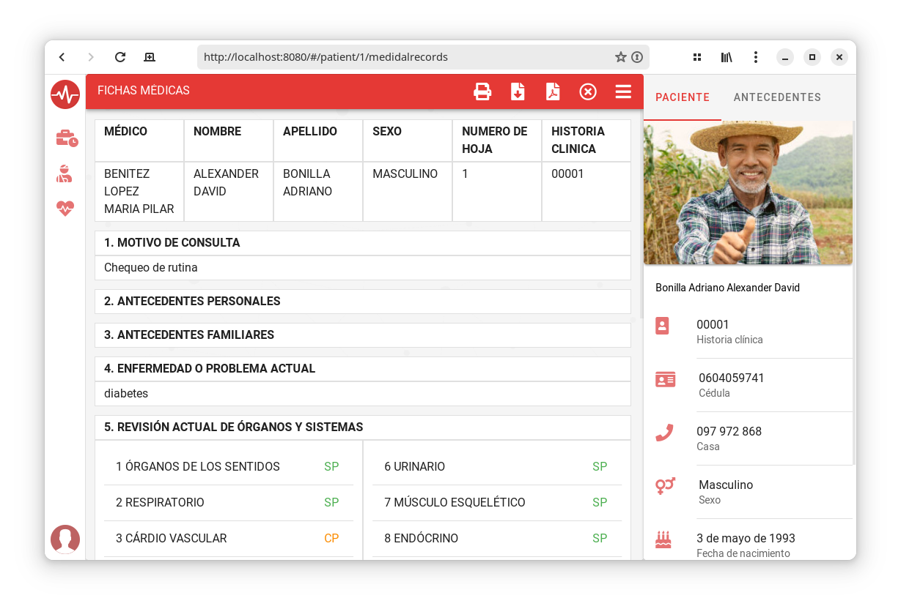

# Sisho

Sisho es una aplicación para la gestión de procesos hospitalarios.



# Environments

Esta sección describe las variables de entorno necesarias para que el _back-end_ pueda funcionar correctamente, manteniendo la privacidad de credenciales.

- **Servidor**

Configuración de las variables del servidor.

| ENV           | POR DEFECTO           | DESCRIPCIÓN                                               |
| :------------ | :-------------------- | :-------------------------------------------------------- |
| SISHO_DOMAIN  | http://localhost:3000 | Nombre del dominio, para la carga de archivos al sistema. |
| SISHO_SANDBOX | sisho/.sandbox        | Directorio para almacenar archivos cargados.              |

- **Base de datos**

El sistema está utilizando _postgresql_ como sistema de gestión de bases de datos, para lo cual es necesario estalecer las credenciales de acceso a dicho sistema de base de datos.

| ENV                | POR DEFECTO | DESCRIPCIÓN                            |
| :----------------- | :---------- | :------------------------------------- |
| SISHO_DATABASE_URL |             | URL de la conexión a la base de datos. |
| SISHO_PGC_HOST     | localhost   | Host de la base de datos.              |
| SISHO_PGC_PORT     | 5432        | Puerto utilizado por la base de datos. |
| SISHO_PGC_USER     | postgres    | Usuario de la base de datos.           |
| SISHO_PGC_PASSWORD | postgres    | Contraseña de la base de datos.        |
| SISHO_PGC_DATABASE | sisho       | Nombre de la base de datos.            |

- **Token de acceso**

Variables para el token de acceso que permite la autenticación de un usuario y el uso de la API.

| ENV                    | POR DEFECTO    | DESCRIPCIÓN                                    |
| ---------------------- | -------------- | ---------------------------------------------- |
| SISHO_TOKEN_SECRET     | My\$3cREtP4\$S | Clave para el cifrado del token de acceso.     |
| SISHO_TOKEN_EXPIRES_IN | 3600           | Tiempo de validez de un token en milisegundos. |

- **Servicio de correo electrónico**

Para facilitar la creación de una cuenta de usuario y la restauración de contraseñas se recomienda utilizar un correo electrónico, para habilitar este servicio se requieren las tres variables que se muestran a continuación, si las variables no existen, los servicios de correo electrónico no estará disponibles.

| ENV                  | EJEMPLO            | DESCRIPCIÓN                                       |
| :------------------- | :----------------- | :------------------------------------------------ |
| SISHO_SMTP_HOST      | smtp.office365.com | Nombre de host o la dirección IP para conectarse. |
| SISHO_EMAIL_ADDRESS  | user@example.com   | Cuenta de correo electrónico                      |
| SISHO_EMAIL_PASSWORD | My\$3cREtP4\$S     | Contraseña de correo electrónico                  |


## Inicialización de la DB

Para inicializar una DB de prueba ejecutar las siguientes lineas de comando.

```shell
createdb -U postgres sisho
```

Si se crea por primera vez la base de datos.
```shell
createdb -U postgres sisho && yarn build && yarn migrate
```
Si desea borrar y crearla nuevamente.
```shell
dropdb -U postgres sisho && createdb -U postgres sisho && yarn build && yarn migrate
```


## Configuración HUA

Estos datos estan adaptados a los requerimientos del Hospital Universitario Andino **( HUA )**. Para la exportación de los datos hacia postgres se ejecuta las sigientes linea de comandos.

- Exportar roles de usuario.
```shell
psql -U postgres -d sisho -f sql/ROLES.sql
```

- Exportar examenes médicos.
```shell
psql -U postgres -d sisho -f sql/MEDICALEXAMS.sql
```

- Exportar enfermedades.
```shell
psql -U postgres -d sisho -f sql/CIE10/CIE10DOC00.sql -f sql/CIE10/CIE10DOC01.sql -f sql/CIE10/CIE10DOC02.sql -f sql/CIE10/CIE10DOC03.sql -f sql/CIE10/CIE10DOC04.sql -f sql/CIE10/CIE10DOC05.sql -f sql/CIE10/CIE10DOC06.sql -f sql/CIE10/CIE10DOC07.sql -f sql/CIE10/CIE10DOC08.sql -f sql/CIE10/CIE10DOC09.sql -f sql/CIE10/CIE10DOC10.sql -f sql/CIE10/CIE10DOC11.sql -f sql/CIE10/CIE10DOC12.sql -f sql/CIE10/CIE10DOC13.sql -f sql/CIE10/CIE10DOC14.sql -f sql/CIE10/CIE10DOC15.sql
```
Si se desea exportar todo a la vez, ejecutar el comando.

```shell
psql -U postgres -d sisho -f sql/ROLES.sql -f sql/MEDICALEXAMS.sql -f sql/CIE10/CIE10DOC00.sql -f sql/CIE10/CIE10DOC01.sql -f sql/CIE10/CIE10DOC02.sql -f sql/CIE10/CIE10DOC03.sql -f sql/CIE10/CIE10DOC04.sql -f sql/CIE10/CIE10DOC05.sql -f sql/CIE10/CIE10DOC06.sql -f sql/CIE10/CIE10DOC07.sql -f sql/CIE10/CIE10DOC08.sql -f sql/CIE10/CIE10DOC09.sql -f sql/CIE10/CIE10DOC10.sql -f sql/CIE10/CIE10DOC11.sql -f sql/CIE10/CIE10DOC12.sql -f sql/CIE10/CIE10DOC13.sql -f sql/CIE10/CIE10DOC14.sql -f sql/CIE10/CIE10DOC15.sql
```
